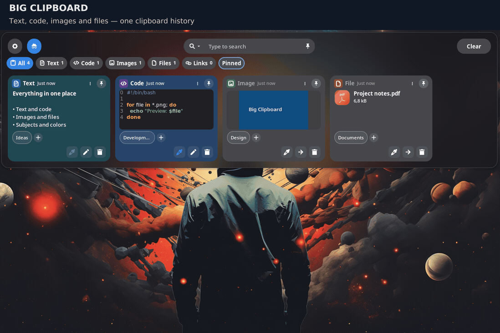
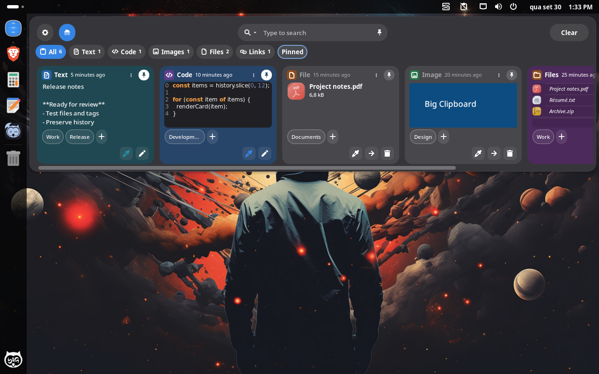
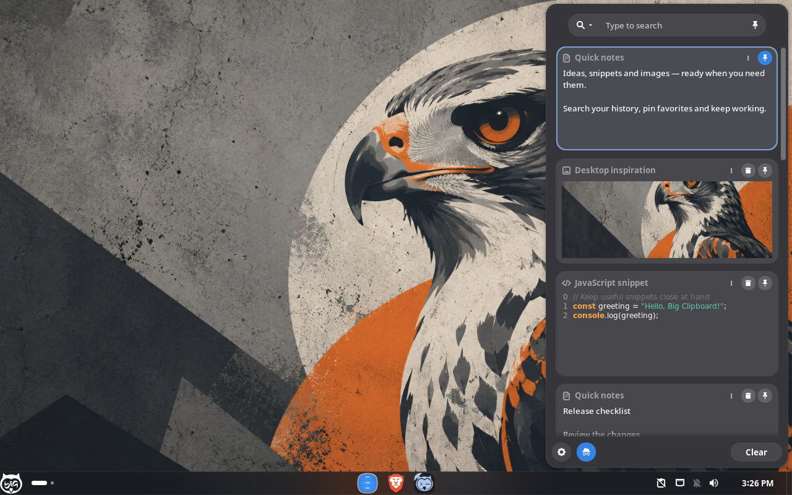
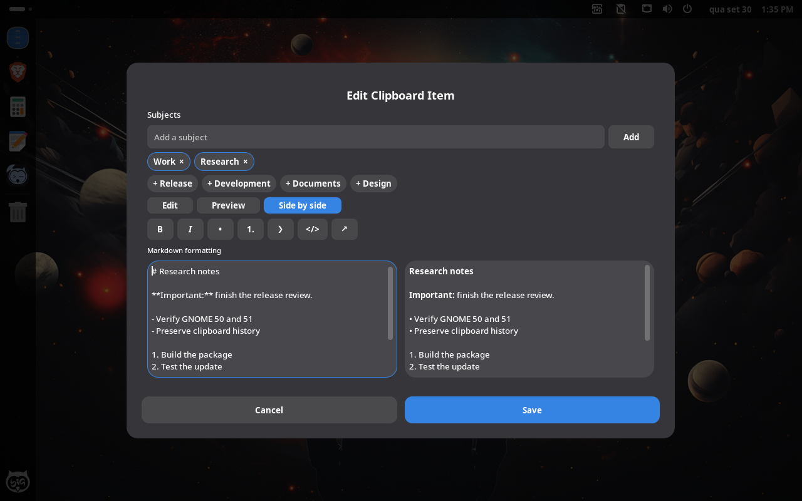

<h1 align="center">
  <br/>
  Big Clipboard
</h1>
<p align="center">Clipboard history for GNOME, maintained by BigCommunity.</p>
<p align="center">
  
  
  
  
  <a href="LICENSE"></a>
</p>

**Big Clipboard** is a fork of [Copyous by boerdereinar](https://github.com/boerdereinar/copyous), maintained by **BigCommunity** for integration with [Big Gnome Center](https://github.com/big-comm/big-gnome-center).

This repository contains the extension source, BigCommunity modifications and distribution packaging. The original authors retain credit for Copyous; the changes below focus on large clipboard histories, GNOME compatibility and layout switching.

Watch the English walkthrough recorded on **GNOME 51 with Frosted Glass blur**: copy text to create a card, edit Markdown notes, add subjects and colors, pin favorites, browse code/images/PDF files with larger previews and compact card footers, search by subject, and switch between light and dark themes.



<details>
<summary>Still screenshots</summary>

Horizontal history on GNOME 50.4, with colored notes, code, files and images:



Vertical history on GNOME 51.0, with file previews and subject labels:



Markdown editing with formatting tools, subject labels and a preview:



</details>

## BigCommunity changes

| Area | Changes in this fork |
| --- | --- |
| Notes and subjects | Edit text with Markdown tools and an on-demand preview. Assign multiple subject labels alongside color tags; search subjects with `#name`. |
| Appearance | Opaque colored cards with contrasting text that follow the desktop light/dark preference, sidebar preferences and optional GNOME 51 background blur. |
| Opening large histories | Prepare the first **12 cards** instead of creating a card for every saved entry. Load additional pages while scrolling. |
| Search and navigation | Search the full history without creating every card. The End key loads remaining matches in small batches. Closing returns to the first page. |
| Image previews | Load nearby previews on demand. Read image metadata asynchronously and cancel pending work when cards are destroyed. |
| Long text and code | Limit rendered previews to 4096 characters. Search and clipboard copying retain the full content. |
| Extension lifecycle | Disconnect card callbacks and guard asynchronous work across disable/enable cycles. Handle search resets during closing without leaving an incomplete first page. |
| GNOME compatibility | Adapt shader effects, input handling and button masks for GNOME 50 and 51. |
| Big Gnome Center integration | Migrate the extension UUID while preserving settings, clipboard data and the D-Bus API. Validate opening after transitions through all six BGC layouts. |
| Packaging and checks | Keep source and PKGBUILD together under BigCommunity. Run type checks and focused regression tests in CI and package checks. |

The package replaces `gnome-shell-extension-copyous`. The extension UUID is `big-clipboard@communitybig.org`. The package migrates activation before GNOME Shell starts; log out and back in after upgrading. Legacy storage paths, settings and the D-Bus API remain compatible, preserving history, images and custom actions. Updated Big Gnome Center layouts use the new UUID and migrate saved profiles. See [upgrade notes](docs/UPGRADE.md).

## Validation and performance

Tested in **GNOME 50.4 and 51.0 VMs**, with 1000 mixed text/image/code entries and a separate 10000-entry text stress test. Validation covered repeated opening, scrolling, full-history search, text/image copying, pinning, deletion, light/dark appearance and transitions through BigGnome, Desk UX, Hybrid, G-Unity, Classic and Minimal.

With 1000 mixed entries, the first painted frame took about **142 ms on GNOME 50.4** and **218 ms on GNOME 51.0** in these VMs. Reopenings took **52–139 ms**. These measurements depend on the VM and host; they measure the first frame, not completion of the opening animation.

Paging limits initial card creation. Entry metadata still loads into memory at startup, and scrolling through the entire history can create more cards. GNOME 48/49 remain declared upstream targets but were not tested in this VM round.

See the [performance report](docs/PERFORMANCE.md) for measurements, test coverage and remaining limitations.

## Notes and organization

Choose the **Edit** pencil in the card footer on a text card to use bold, italic, bullet and numbered lists, quotes, inline code or links. **Ctrl+B** and **Ctrl+I** format the selection. Switch between **Edit** and **Preview**, or use **Side by side** on larger displays; saving and copying retain the Markdown source. Code cards keep their language selector and plain code editor.

Text cards render Markdown formatting directly; copying and editing retain the original source. Code detection prioritizes interpreter declarations such as `#!/bin/bash`, and existing text cards can display detected code without rewriting saved history.

The preview supports these tools, headings and fenced code blocks. It treats HTML as text, never fetches remote content and never executes links. Only the first 20,000 characters are rendered in the preview; the complete note remains stored and copied.

Choose the subject icon in a card's footer, including on images and files, or edit subjects with a note. Once subjects are assigned, use **+** beside their labels to add more. Add names with Enter or commas, for example `Work, Research`. Reuse suggested subjects and remove a label with its × button. Search for `#Work` to match subject names, or use ordinary search to match subjects and content together. Existing color and pinned filters can be combined with subject searches. Remove names from the field to unassign them.

Subject labels follow the same retention and deletion protection settings as color tags. SQLite receives an additive, transactional schema update; JSON gains an optional field. Existing text, images, pins, colors, metadata and storage locations remain intact. As with color tags, explicit **clear all** removes labeled items too.

## Cards and files

The compact horizontal panel and vertical view share quick type filters and a pinned filter. Counts use history metadata; only the first 12 matching cards are initially created. Cards default to 250 × 210 pixels. Subject labels and their add button share a single footer row with color, edit/open and delete controls, leaving more room for previews. Long subject lists collapse into a count without displacing the actions. Pinning stays in the header, separate from deletion. The three-dot menu contains additional actions. In **Behavior**, enable **Paste Directly on Selection** to paste a selected card into the active application; disable it to copy only. Shift-click or Shift+Enter performs the opposite action. Existing activation preferences are preserved. Footer buttons do not copy the card. Enable **Appearance → Dialog → Compact Filters** to show icons and counts, with filter names on hover or keyboard focus.

Copy PDFs, documents, archives, folders or multiple files in the file manager, then select their card and paste into a destination folder. File cards show the name, a MIME-type icon and asynchronously loaded metadata. File groups show up to 12 rows with icons and a remaining count. File history stores references, not backup copies: moving or deleting an original can make its entry unavailable. Reusing a cut entry copies the original instead of repeating a destructive move.

Preferences retain the 830 × 610 default size, searchable sidebar and native shortcut labels. Appearance controls are grouped separately from behavior, shortcuts, actions and storage.

## Features inherited from Copyous

- Text, code, images, files, links, characters and colors.
- Open at the mouse pointer or text cursor.
- Pin favorite items and organize them with nine colored tags.
- Customizable clipboard actions, shortcuts and appearance.
- Persistent clipboard history and a D-Bus interface.

## Installation

### BigCommunity package

The distribution package is `gnome-shell-extension-big-clipboard`. Highlight.js 11.11.1 and all 192 language modules are included with verified checksums and the upstream license. No runtime download is needed; 36 common languages load by default, and extra languages can be enabled in preferences. Its [PKGBUILD](pkgbuild/PKGBUILD) uses the source in this repository, with GNOME Shell 48 or newer, Libgda 6 and GSound as runtime dependencies.

To build the package with Arch packaging tools:

```sh
cd pkgbuild
makepkg -s
```

The standalone PKGBUILD defaults to **`main`**. BigCommunity testing builds use **`dev-talesam`**, selected by the build pipeline. Check the source revision in the build log; changing the local branch alone does not change the standalone PKGBUILD source.

### Manual ZIP installation

Use the compiled `big-clipboard@communitybig.org.shell-extension.zip` attached to a Big Clipboard release, when available. GitHub's automatic **Source code (zip)** download is not an installable extension. Compiled ZIPs belong in release assets, not in the source tree.

Install GNOME Shell 48–51, Libgda 6 and GSound through your distribution first. GNOME 50 and 51 have been tested. Highlight.js and translations are bundled. On BigCommunity, prefer the distribution package so updates and UUID migration are managed automatically; a manual user installation overrides the system package.

If migrating from Copyous, disable it before installing:

```sh
gnome-extensions disable copyous@boerdereinar.dev
```

Install the downloaded ZIP without `sudo`:

```sh
gnome-extensions install --force ./big-clipboard@communitybig.org.shell-extension.zip
```

Log out and back in, then enable Big Clipboard:

```sh
gnome-extensions enable big-clipboard@communitybig.org
```

The manual ZIP does not install the package's activation migration hook. Keep Copyous disabled; existing history and settings use the same storage locations. See [upgrade notes](docs/UPGRADE.md).

To create an installable ZIP from a prepared source checkout:

```sh
make RELEASE=1 build
```

The output is `dist/big-clipboard@communitybig.org.zip`; `dist/` is excluded from Git. Rename the file to `big-clipboard@communitybig.org.shell-extension.zip` when attaching it to a release.

### Build this fork from source

Install Node.js, pnpm, Make, jq, gettext, zip and the runtime dependencies above. The PKGBUILD lists the distribution build dependencies.

```sh
git clone --recurse-submodules https://github.com/big-comm/gnome-shell-extension-big-clipboard.git
cd gnome-shell-extension-big-clipboard
pnpm install --frozen-lockfile --ignore-scripts
pnpm exec tsc --noEmit
pnpm test
make RELEASE=1 install
```

Log out and back in after replacing an installed extension so GNOME Shell loads the updated JavaScript. Then enable Big Clipboard:

```sh
gnome-extensions enable big-clipboard@communitybig.org
```

The [upstream GNOME Extensions listing](https://extensions.gnome.org/extension/8834/copyous/) and [upstream releases](https://github.com/boerdereinar/copyous/releases) distribute the original project, not this BigCommunity fork.

## Configuration

You can open the extension settings either through the panel indicator, [Extension Manager](https://flathub.org/en/apps/com.mattjakeman.ExtensionManager) or by running the following command:
```shell
gnome-extensions prefs big-clipboard@communitybig.org
```

## Shortcuts

The most common shortcuts are listed below. Some can be customized in the extension settings. You can also find a complete list of all available shortcuts there.

| Description           | Shortcut                                                                                                      |
|-----------------------|---------------------------------------------------------------------------------------------------------------|
| Open Clipboard Dialog | <kbd>Super</kbd> <kbd>Shift</kbd> <kbd>V</kbd>                                                                |
| Toggle Incognito Mode | <kbd>Super</kbd> <kbd>Shift</kbd> <kbd>Ctrl</kbd> <kbd>V</kbd>                                                |
| Copy Item             | <kbd>Enter</kbd> / <kbd>Space</kbd>                                                                           |
| Run Default Action    | <kbd>Ctrl</kbd> <kbd>Enter</kbd> / <kbd>Space</kbd>                                                           |
| Pin Item              | <kbd>Ctrl</kbd> <kbd>S</kbd>                                                                                  |
| Delete Item           | <kbd>Delete</kbd> (Hold <kbd>Shift</kbd> to force delete)                                                     |
| Navigation            | <kbd>Tab</kbd> / <kbd>↑</kbd> / <kbd>↓</kbd> / <kbd>←</kbd> / <kbd>→</kbd> / <kbd>Home</kbd> / <kbd>End</kbd> |
| Jump to Item          | <kbd>Ctrl</kbd> <kbd>0</kbd>...<kbd>9</kbd>                                                                   |
| Toggle Pinned Search  | <kbd>Alt</kbd>                                                                                                |
| Cycle Item Type       | <kbd>Ctrl</kbd> <kbd>Tab</kbd> / <kbd>Shift</kbd> <kbd>Ctrl</kbd> <kbd>Tab</kbd>                              |
| Cycle Item Tag        | <kbd>Ctrl</kbd> <kbd>\`</kbd> / <kbd>Shift</kbd> <kbd>Ctrl</kbd> <kbd>\`</kbd>                                |

## DBus

**Name:** `org.gnome.Shell.Extensions.Copyous`
**Path:** `/org/gnome/Shell/Extensions/Copyous`

| Method         | Arguments                                                                                                    | Description                       |
|----------------|--------------------------------------------------------------------------------------------------------------|-----------------------------------|
| `Toggle`       |                                                                                                              | Show or hide the clipboard dialog |
| `Show`         |                                                                                                              | Show the clipboard dialog         |
| `Hide`         |                                                                                                              | Hide the clipboard dialog         |
| `ClearHistory` | `all`:<br/>&emsp; if `true`, clears all history; <br/>&nbsp;&emsp;if `false`, clears unpinned/untagged items | Clear clipboard history           |

### Examples

```shell
gdbus call --session \
    --dest org.gnome.Shell.Extensions.Copyous \
    --object-path /org/gnome/Shell/Extensions/Copyous \
    --method org.gnome.Shell.Extensions.Copyous.Toggle
```
```shell
gdbus call --session \
    --dest org.gnome.Shell.Extensions.Copyous \
    --object-path /org/gnome/Shell/Extensions/Copyous \
    --method org.gnome.Shell.Extensions.Copyous.ClearHistory false
```

## Contributing

Report issues with this fork in the [BigCommunity repository](https://github.com/big-comm/gnome-shell-extension-big-clipboard/issues). Include the GNOME version, extension revision, active BGC layout and reproduction steps.

See [CONTRIBUTING.md](CONTRIBUTING.md) for the development workflow and [tests/vm/README.md](tests/vm/README.md) for the optional VM fixture.

## Credits

[Copyous](https://github.com/boerdereinar/copyous) was created by **boerdereinar and contributors** as a full rewrite of [Pano](https://github.com/oae/gnome-shell-pano). BigCommunity maintains this fork and its distribution-specific modifications. Upstream history and attribution are preserved.

## License

Extension code remains licensed under [GNU GPL-3.0-or-later](LICENSE). The packaging license is preserved separately in [pkgbuild/LICENSE](pkgbuild/LICENSE).
