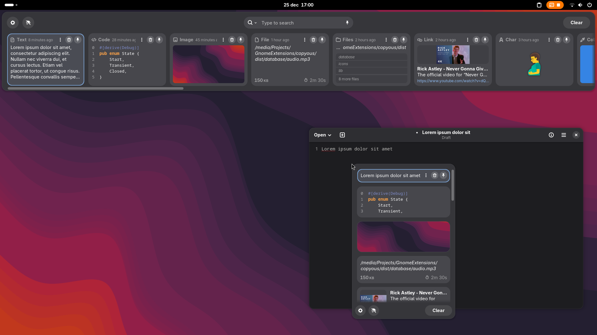

#  Copyous — BigCommunity fork

[](LICENSE)

A fork of [Copyous by boerdereinar](https://github.com/boerdereinar/copyous), maintained by **BigCommunity** for integration with [Big Gnome Center](https://github.com/big-comm/big-gnome-center).

This repository contains the extension source, BigCommunity modifications and distribution packaging. The original authors retain credit for Copyous; the changes below focus on large clipboard histories, GNOME compatibility and layout switching.



## BigCommunity changes

| Area | Changes in this fork |
| --- | --- |
| Opening large histories | Prepare the first **12 cards** instead of creating a card for every saved entry. Load additional pages while scrolling. |
| Search and navigation | Search the full history without creating every card. The End key loads remaining matches in small batches. Closing returns to the first page. |
| Image previews | Load nearby previews on demand. Read image metadata asynchronously and cancel pending work when cards are destroyed. |
| Long text and code | Limit rendered previews to 4096 characters. Search and clipboard copying retain the full content. |
| Extension lifecycle | Disconnect card callbacks and guard asynchronous work across disable/enable cycles. Handle search resets during closing without leaving an incomplete first page. |
| GNOME compatibility | Adapt shader effects, input handling and button masks for GNOME 50 and 51. |
| Big Gnome Center integration | Preserve the extension UUID, settings schema, clipboard database format and D-Bus API. Validate opening after transitions through all six BGC layouts. |
| Packaging and checks | Keep source and PKGBUILD together under BigCommunity. Run type checks and focused regression tests in CI and package checks. |

The extension keeps the UUID `copyous@boerdereinar.dev` so existing settings and integrations continue to work. The upstream extension and this fork therefore occupy the same extension slot.

## Validation and performance

Tested in **GNOME 50.4 and 51.0 VMs**, with 1000 mixed text/image/code entries and a separate 10000-entry text stress test. Validation covered repeated opening, scrolling, full-history search, text/image copying, pinning, deletion, light/dark appearance and transitions through BigGnome, Desk UX, Hybrid, G-Unity, Classic and Minimal.

With 1000 mixed entries, the first painted frame took about **142 ms on GNOME 50.4** and **218 ms on GNOME 51.0** in these VMs. Reopenings took **52–139 ms**. These measurements depend on the VM and host; they measure the first frame, not completion of the opening animation.

Paging limits initial card creation. Entry metadata still loads into memory at startup, and scrolling through the entire history can create more cards. GNOME 48/49 remain declared upstream targets but were not tested in this VM round.

See the [performance report](docs/PERFORMANCE.md) for measurements, test coverage and remaining limitations.

## Features inherited from Copyous

- Text, code, images, files, links, characters and colors.
- Open at the mouse pointer or text cursor.
- Pin favorite items and organize them with nine colored tags.
- Customizable clipboard actions, shortcuts and appearance.
- Persistent clipboard history and a D-Bus interface.

## Installation

### BigCommunity package

The distribution package is `gnome-shell-extension-copyous`. Its [PKGBUILD](pkgbuild/PKGBUILD) uses the source in this repository, with GNOME Shell 48 or newer, Libgda 6 and GSound as runtime dependencies.

To build the package with Arch packaging tools:

```sh
cd pkgbuild
makepkg -s
```

The PKGBUILD explicitly fetches **`main`**. Changes must be published to that branch before a remote package build includes them; building the PKGBUILD from another branch does not change its source branch.

### Build this fork from source

Install Node.js, pnpm, Make, jq, gettext, zip and the runtime dependencies above. The PKGBUILD lists the distribution build dependencies.

```sh
git clone --recurse-submodules https://github.com/big-comm/gnome-shell-extension-copyous.git
cd gnome-shell-extension-copyous
pnpm install --frozen-lockfile --ignore-scripts
pnpm exec tsc --noEmit
pnpm test
make RELEASE=1 install
```

Log out and back in after replacing an installed extension so GNOME Shell loads the updated JavaScript. Then enable Copyous:

```sh
gnome-extensions enable copyous@boerdereinar.dev
```

The [upstream GNOME Extensions listing](https://extensions.gnome.org/extension/8834/copyous/) and [upstream releases](https://github.com/boerdereinar/copyous/releases) distribute the original project, not this BigCommunity fork.

## Configuration

You can open the extension settings either through the panel indicator, [Extension Manager](https://flathub.org/en/apps/com.mattjakeman.ExtensionManager) or by running the following command:
```shell
gnome-extensions prefs copyous@boerdereinar.dev
```

## Shortcuts

The most common shortcuts are listed below. Some can be customized in the extension settings. You can also find a complete list of all available shortcuts there.

| Description           | Shortcut                                                                                                      |
|-----------------------|---------------------------------------------------------------------------------------------------------------|
| Open Clipboard Dialog | <kbd>Super</kbd> <kbd>Shift</kbd> <kbd>V</kbd>                                                                |
| Toggle Incognito Mode | <kbd>Super</kbd> <kbd>Shift</kbd> <kbd>Ctrl</kbd> <kbd>V</kbd>                                                |
| Copy Item             | <kbd>Enter</kbd> / <kbd>Space</kbd>                                                                           |
| Run Default Action    | <kbd>Ctrl</kbd> <kbd>Enter</kbd> / <kbd>Space</kbd>                                                           |
| Pin Item              | <kbd>Ctrl</kbd> <kbd>S</kbd>                                                                                  |
| Delete Item           | <kbd>Delete</kbd> (Hold <kbd>Shift</kbd> to force delete)                                                     |
| Navigation            | <kbd>Tab</kbd> / <kbd>↑</kbd> / <kbd>↓</kbd> / <kbd>←</kbd> / <kbd>→</kbd> / <kbd>Home</kbd> / <kbd>End</kbd> |
| Jump to Item          | <kbd>Ctrl</kbd> <kbd>0</kbd>...<kbd>9</kbd>                                                                   |
| Toggle Pinned Search  | <kbd>Alt</kbd>                                                                                                |
| Cycle Item Type       | <kbd>Ctrl</kbd> <kbd>Tab</kbd> / <kbd>Shift</kbd> <kbd>Ctrl</kbd> <kbd>Tab</kbd>                              |
| Cycle Item Tag        | <kbd>Ctrl</kbd> <kbd>\`</kbd> / <kbd>Shift</kbd> <kbd>Ctrl</kbd> <kbd>\`</kbd>                                |

## DBus

**Name:** `org.gnome.Shell.Extensions.Copyous`
**Path:** `/org/gnome/Shell/Extensions/Copyous`

| Method         | Arguments                                                                                                    | Description                       |
|----------------|--------------------------------------------------------------------------------------------------------------|-----------------------------------|
| `Toggle`       |                                                                                                              | Show or hide the clipboard dialog |
| `Show`         |                                                                                                              | Show the clipboard dialog         |
| `Hide`         |                                                                                                              | Hide the clipboard dialog         |
| `ClearHistory` | `all`:<br/>&emsp; if `true`, clears all history; <br/>&nbsp;&emsp;if `false`, clears unpinned/untagged items | Clear clipboard history           |

### Examples

```shell
gdbus call --session \
    --dest org.gnome.Shell.Extensions.Copyous \
    --object-path /org/gnome/Shell/Extensions/Copyous \
    --method org.gnome.Shell.Extensions.Copyous.Toggle
```
```shell
gdbus call --session \
    --dest org.gnome.Shell.Extensions.Copyous \
    --object-path /org/gnome/Shell/Extensions/Copyous \
    --method org.gnome.Shell.Extensions.Copyous.ClearHistory false
```

## Contributing

Report issues with this fork in the [BigCommunity repository](https://github.com/big-comm/gnome-shell-extension-copyous/issues). Include the GNOME version, extension revision, active BGC layout and reproduction steps.

See [CONTRIBUTING.md](CONTRIBUTING.md) for the development workflow and [tests/vm/README.md](tests/vm/README.md) for the optional VM fixture.

## Credits

[Copyous](https://github.com/boerdereinar/copyous) was created by **boerdereinar and contributors** as a full rewrite of [Pano](https://github.com/oae/gnome-shell-pano). BigCommunity maintains this fork and its distribution-specific modifications. Upstream history and attribution are preserved.

## License

Extension code remains licensed under [GNU GPL-3.0-or-later](LICENSE). The packaging license is preserved separately in [pkgbuild/LICENSE](pkgbuild/LICENSE).
